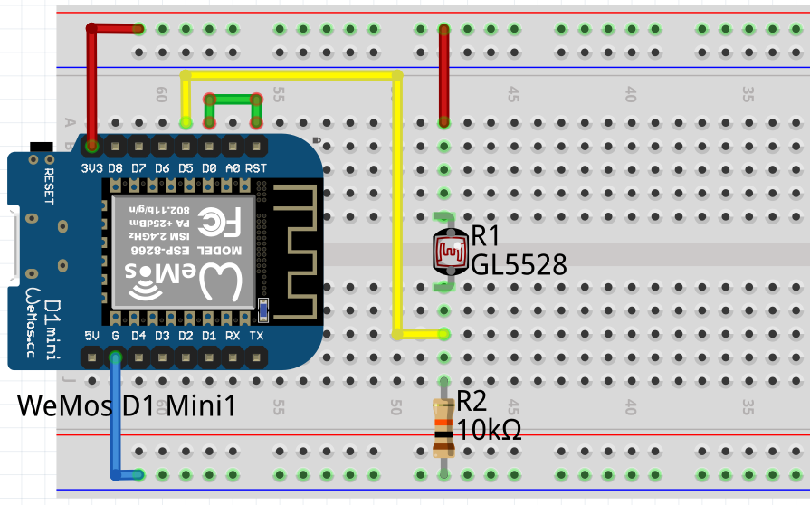

# LightSense

This little project aims to provide a small and handy tool to retro fit older devices that signal events via light (LEDs for example). To achive this we use a photo resistor and a small microcontroller to translate the light signal into "on" and "off". The change of state can then be processed further.

## Components

As microcontroller a D1 Mini (ESP8266 based) is used. The photo resistor is a GL5528 and additionally a 10kΩ resistor is needed.

## Basic layout

The basic layout of the circuit can be found as sketch on a breadboard in the following picture:



The red connections are the 3V3 connection, the blue one is ground. The yellow connection is transfering data (meassuring voltage) and the green one is needed to be able to wake from deepsleep.

## Software

As programming language [micropython](https://docs.micropython.org/en/latest/index.html) is used.

For more information about using micropython on the D1 mini see here: [Quick Start](https://docs.micropython.org/en/latest/esp8266/tutorial/index.html)

Micropython knows two special files:

- __[boot.py](code/boot.py)__ which is executed directly after booting.
- __[main.py](code/main.py)__ which is exectued after boot.py completes.

In this app ```boot.py``` is used to load the config parameters from config.json. The main.py holds the logic and executes after all config parameters are loaded.

The file ```data``` is used to store the last meassured value, and ```cycles``` is used to store the remaining cylces before shuting down.

## config.json

The config.json holds all parameters for easy configuration of the app.

```jsonc
{
    "wifi" : {
        "ssid" : "YOUR_SSID", // SSID of your wifi AP
        "passwd" : "WiF1-p@s$wd" // password of your wifi AP
    },
    "rest" : {
        "url" : "http://your-server/endpoint", // the endpoint to send the data to
        "config" : "http://your-server/endpoint/config" // the enpoint to get the config from
    },
    "sleep_time" : 10000, // the milliseconds to sleep between each measurement
    "operation_time" : 40000 // milliseconds to operate before shutdown
}
```

## Quick start

First assemble the circuit as shown above.

Connect the controller to your PC and install the firmware as described here: [Install micropython](https://docs.micropython.org/en/latest/esp8266/tutorial/intro.html#getting-the-firmware)

Edit the [config.json](resources/config.json) and add the parameters you need.

To upload the files you can use [ampy](https://github.com/scientifichackers/ampy). Upload the following files:

- boot.py
- main.py
- config.json
- data
- cycles

When booting up, the script will request updated configuration parameters from the given endpoint (rest.config). At the moment it will only read ```operation_time``` and ```sleep_time```.

If there is a change in state detected, a message with either 1 (ON) or 0 (OFF) as payload is send to the configured endpoint (rest.url).
